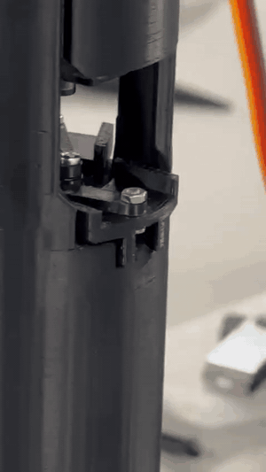
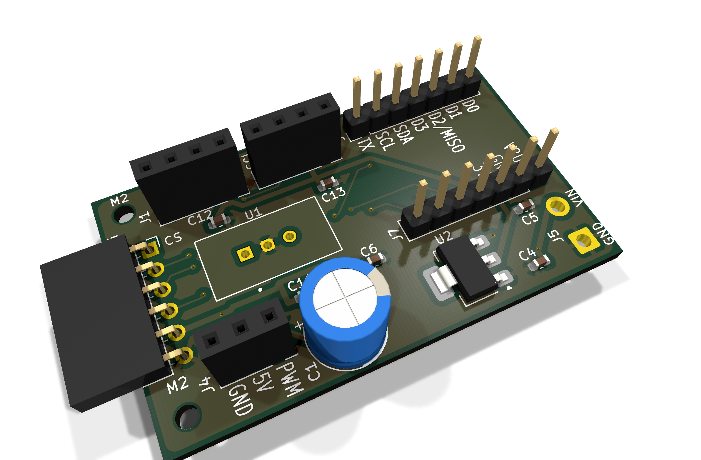
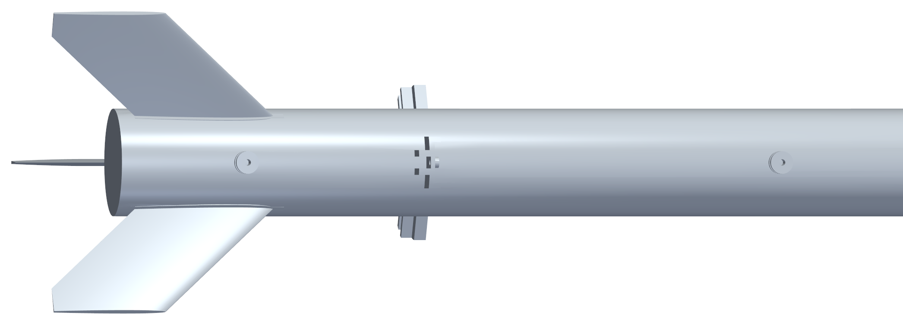

# Icarus - NRC Rocket Flight Controller

This is the avionics for **Icarus**, our entry to the UKSEDS National Rocketry
Championship at Coventry University. I was avionics lead on the team, so what's
in here is the flight computer, the airbrake control code that runs on it, and
the CFD I ran to get the drag numbers that code depends on.

The servo wiggle test running on the bench. It's in `setup()`, so on every power
up the brakes get driven fully open then fully closed before the thing arms. Cheap
way to confirm the servo's actually connected and the linkage is free before you
put it on a rail:



Full quality version with sound is at
[`media/airbrakes-deployment.mp4`](media/airbrakes-deployment.mp4).



## It hasn't flown yet

We withdrew on competition launch day after problems turned up in pre-flight
checks. There's an independent flight test booked to the same parameters.

So everything in this repo is CFD, simulation or bench testing. None of it is
flight validated and it should be read that way.

## The rocket

| | |
|---|---|
| Length | 747.0 mm |
| Body diameter | 50.0 mm |
| Fineness ratio | 14.9 calibers |
| Nose cone | tangent ogive, 117.5 mm (2.35 cal) |
| Fins | 3 at 30 / 150 / 270 deg, 55.0 mm semi-span |
| Airbrakes | 3 blades at 90 / 210 / 330 deg, 12.7 mm proud when deployed |
| Wetted area | 0.1330 m^2 |
| Mass wet / dry | 0.789 kg / 0.7293 kg |
| Motor | AeroTech G78G-7, 109.9 Ns, 1.4 s burn |
| Recovery | separate EggTimer Apogee altimeter |
| Predicted apogee | 563-614 m across the saved OpenRocket runs, 122-125 m/s |

We pull the motor's ejection charge before flight. Recovery runs entirely off a
separate EggTimer Apogee board, so nothing in this repo can drop the parachute
and nothing in this repo can stop it dropping either. That was deliberate. I
didn't want the thing I wrote to be able to lose the rocket.

## What the flight computer does

A Seeed XIAO ESP32-C3 runs a 50 Hz loop, reads an ICM-20948 IMU and a BMP390
barometer, works out altitude and vertical velocity, and drives one servo that
sets how far the airbrakes are out. The point is to hit a target apogee by
dumping the extra energy as drag instead of coasting past it.

Every 20 ms cycle, once the motor's done burning, it:

1. sweeps 41 candidate drag coefficients between `CDClean` and `CDMax`
2. predicts what apogee each one gets you
3. picks whichever lands nearest the 670 m target, with overshoot punished 1.25x
   harder than undershoot (you can always add more drag later, you can never
   take it back)
4. maps that Cd to a servo angle, limited to 3 deg per step

The apogee prediction is a closed form solution rather than a numerical
integration. It comes from `m*dv/dt = -mg - 0.5*rho*Cd*A*v^2`, swapping time for
height, which gives:

```
h = (1/2k) * ln(1 + k*v0^2/g)      where k = rho*Cd*A/(2m)
```

I solve it twice, second pass with the density corrected for the altitude the
first pass says it's going to reach.

That choice matters on this chip. The ESP32-C3 has no hardware FPU, so every
float op is emulated in software. Doing 41 Euler integrations at 50 Hz was never
going to fit. Evaluating a log 41 times does.

### Being honest about the real-time side

This is soft real-time. The loop is a polled timer check inside `loop()`, not a
timer ISR and not a released RTOS task. I have not measured a worst case
execution time and there's no deadline miss detection. SD writes go through a
FreeRTOS queue so card latency can't stall the loop, but that's mitigation, not
a guarantee. I'd rather say that than pretend otherwise.

## Where the drag numbers come from

The controller is only as good as the drag model behind it, so I measured both
ends of it instead of guessing. Two OpenFOAM cases, same mesh and same reference
conditions, only difference being whether the brakes are out:

| Config | Case | Mean Cd | Constant in the firmware |
|---|---|---|---|
| brakes retracted | `cfd/clean/` | 0.472380 | `CDClean = 0.4724` |
| brakes deployed | `cfd/deployed/` | 0.877589 | `CDMax = 0.8776` |

Same mesh, same everything, brakes stowed and brakes out. Rail buttons are on
this side so you can see they're in both, the blades are the only thing that
changes between the two runs:

**Brakes stowed** (`cfd/clean`, Cd 0.4724)


**Brakes deployed** (`cfd/deployed`, Cd 0.8776)



Putting the brakes out is worth 86% more drag. Both numbers are referenced to
the body cross section, `Aref = 0.0019635 m^2` (r = 25 mm), which is the same
value hardcoded in the firmware. That's on purpose, so the CFD and the onboard
prediction can't drift apart.

One thing that catches people out: the total projected frontal area with the
brakes deployed (body plus blades plus fins plus rail buttons) is about
0.00340 m^2, roughly 1.73x the reference area. That's a property of the shape,
not a reference area, and it isn't what any Cd in here is referenced to. Multiply
my coefficients by it and you'll overstate drag by 73%.

## What's in here

`firmware/` has the flight code and a software in the loop sim harness.
`hardware/` has renders of the board. `cfd/` has the OpenFOAM case setups and the
drag results for both configs. `simulation/` has the OpenRocket model, the motor
curve and a MATLAB script for reading flight logs. `geometry/` has the STL the
CFD was actually run against.

### On the board

Renders only. I'm not publishing the schematic, layout, netlist or anything you
could send to a fab. The board's there to show what I built, not to be copied.
Ask me if you need more than that.

The customer payload we carried for the competition isn't in here at all. That
spec isn't mine to publish.

## Attribution

See [NOTICE.md](NOTICE.md). Icarus was a team vehicle and this repo only covers
my part of it.

There's no licence file, which means all rights reserved. Ask before reusing
anything.
