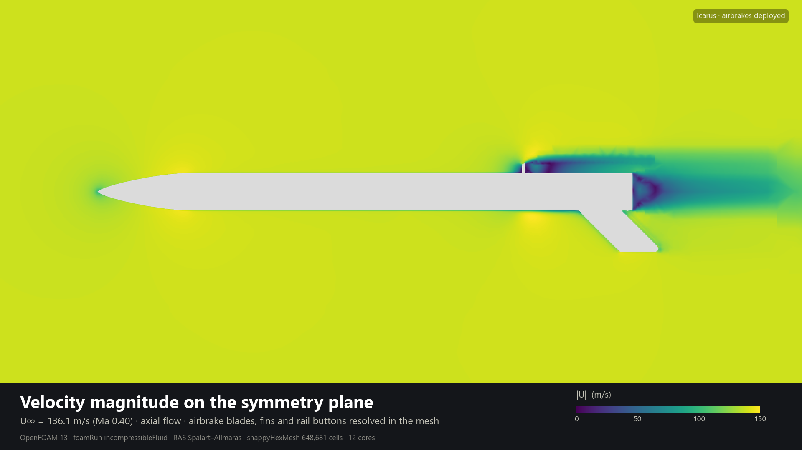
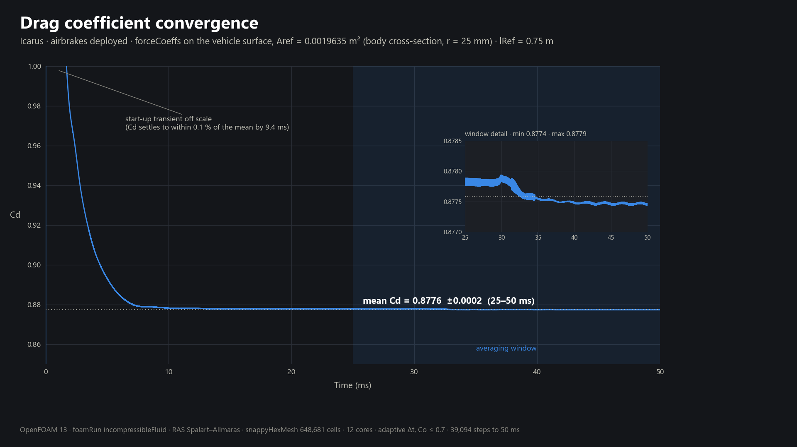
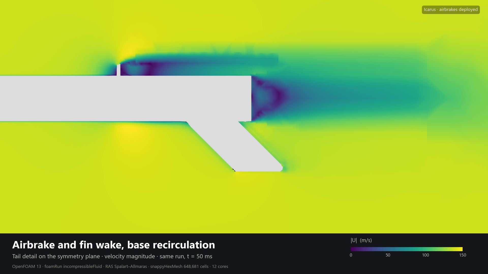
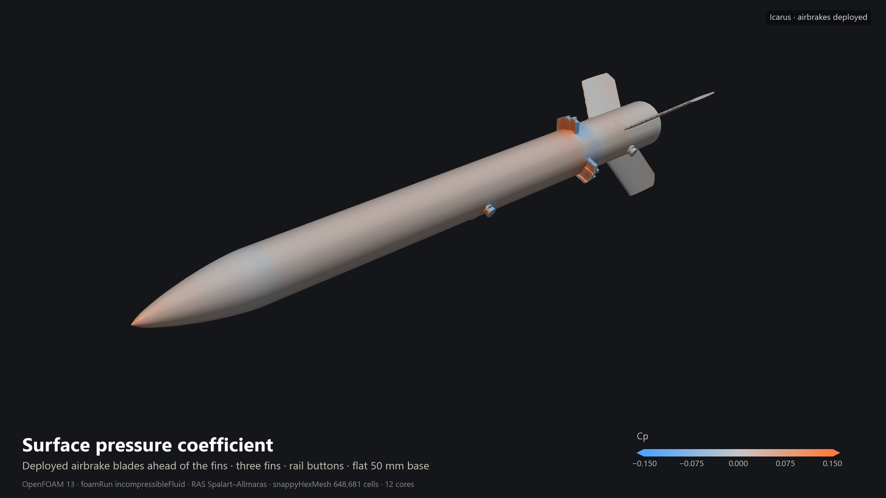
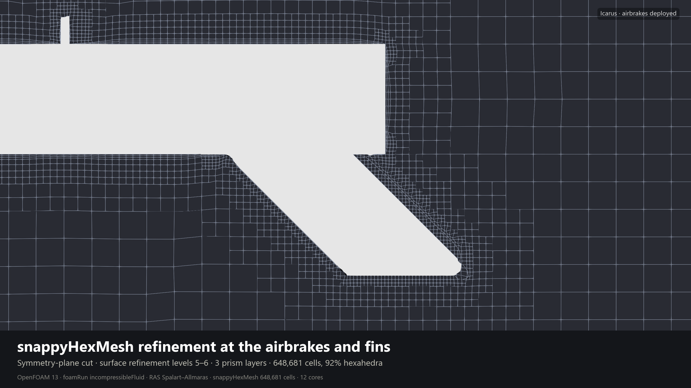

# CFD

Two OpenFOAM cases over the same mesh and the same reference conditions. The only
thing that changes between them is whether the airbrakes are out. These two runs
are where the controller's drag model comes from.

| Case | Brakes | Mean Cd | Firmware constant |
|---|---|---|---|
| `clean/` | retracted | 0.472380 | `CDClean = 0.4724` |
| `deployed/` | deployed | 0.877589 | `CDMax = 0.8776` |

86% more drag with the brakes out. Mean Cd is averaged over 0.025-0.050 s, after
the force history has settled down. `rangeCD.dat` in each case has the standard
deviation and the min/max over that window if you want to see how steady it was.

Cd is inside 0.1% of its own mean by 9.4 ms and the whole averaging window fits in
±0.0002, so the number isn't sensitive to where I put the window.

Every picture on this page is the deployed run at the final time, 0.05 s.

## Setup

| | |
|---|---|
| Solver | OpenFOAM 13, `foamRun` |
| Turbulence | RAS, Spalart-Allmaras |
| Freestream | 136.1 m/s, which is Mach 0.40 |
| Density | 1.225 kg/m^3 |
| Kinematic viscosity | 1.5e-5 m^2/s |
| Reynolds number | about 6.8e6 on lRef = 0.75 m |
| Reference area | 0.0019635 m^2, body cross section at r = 25 mm |
| Reference length | 0.75 m |
| Time stepping | adjustable, max Courant 0.7, ends at 0.05 s |

`Aref` is the body cross section. It is not the total projected frontal area of
the deployed config (that's about 0.00340 m^2, 1.73x bigger). The firmware uses
the same 0.0019635, so the CFD and what the rocket thinks are always the same
number.
Don't mix the two up.

## What the flow looks like

The blades sit just ahead of the fins and throw a thick low speed wake straight
down the fin span. The flat base is doing its own share behind that, with the
recirculation sitting in the middle of it.

Cp on the skin. High pressure on the nose and on the leading face of each blade,
suction immediately behind them, and the rail buttons showing up as their own
little pressure spots. The scale is clipped at ±0.15 so the nose saturates, real
stagnation Cp there is about 1.

The mesh around the tail. Surface refinement levels 5-6, 3 prism layers, 648,681
cells with 92% of them hexahedra. `checkMesh` flagged 8 highly skewed faces, so
it isn't a clean pass.

## Where these numbers are weak

Worth being straight about, because it tells you how far to trust them.

The solver is incompressible and I'm running it at Mach 0.40. The usual rule of
thumb is incompressible holds to about Mach 0.3. At 0.40 the real density
variation over the vehicle is something like 8%, so treat these as a solid
engineering estimate rather than a converged compressible answer.

The airbrake blades are modelled as detached plates. In the mesh the radius jumps
from 25.0 to 33.4 mm with an 8.4 mm gap, and there's no linkage or slot geometry
in there at all.

The back end is a flat 50 mm disc. No nozzle, no boat tail. Base drag is doing
real work in the clean number because of that.

Axial flow only, one angle of attack. No yaw or pitch sweep.