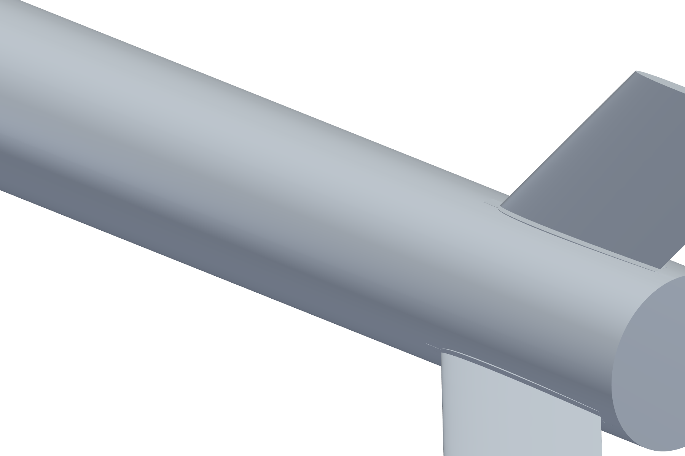
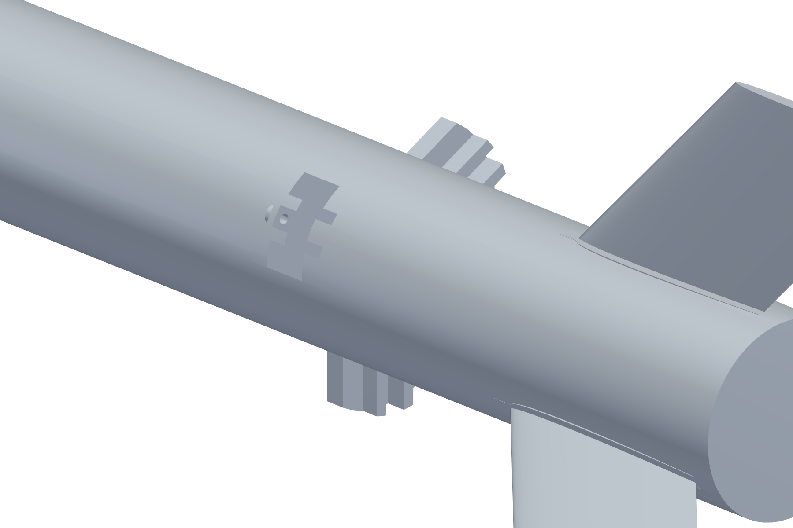

# Geometry

`SRocketMesh.stl` is the deployed airbrake outer skin and it's the exact surface
the CFD in [`../cfd/`](../cfd/) ran against.

24,810 triangles, roughly 3.3 mm mean edge length, one `zone0` solid, units in
metres.

## The two configurations

Both meshes rendered from the same camera, viewed from the side the rail buttons
are on. Brakes stowed first, then deployed.

Closer in on the blade station, same pair:

I checked the two meshes actually match everywhere else before running them.
Walking the radius along the body they're identical, including the rail buttons
at r = 31.93 mm, and the only station that differs is x = -160 to -120 mm where
the deployed mesh goes out to r = 37.69 mm and the clean one stays at 25.00 mm.
So the difference in Cd between the two runs is the airbrakes and nothing else.

## Measured dimensions

I took these off the STL itself rather than out of CAD, so they're what the
solver actually saw rather than what the model was supposed to be.

| | |
|---|---|
| Overall length | 747.0 mm |
| Body diameter | 50.0 mm (r = 25.0) |
| Fineness ratio | 14.9 calibers |
| Nose cone | tangent ogive, 117.5 mm (2.35 cal), fits to about 1 mm |
| Parallel body | x = 117.5 to 640.5 mm (523 mm) |
| Fins | 3, at 30 / 150 / 270 deg |
| Fin root / tip chord | 106.5 mm / 53.8 mm |
| Fin semi-span | 55.0 mm from the wall, 160 mm tip to tip (3.2 cal) |
| Fin LE sweep | about 44.5 deg |
| Fin section | tapered, 3.25 mm max thickness, 0.6 mm at the TE |
| Airbrakes | 3 blades at 90 / 210 / 330 deg, interleaved between the fins |
| Blade station | x = 564.5-575.0 mm, 10.5 mm streamwise |
| Blade arc | 38.2 deg each, so 114.6 deg total, about 32% of the circumference |
| Blade deployment | outer face at r = 37.7 mm, 12.7 mm proud of the body |
| Rail buttons | 2 at 210 deg, 10.5 mm long, 6.9 mm proud, x = 398 and 649 mm |
| Wetted area | 0.1330 m^2 |
| Enclosed volume | 1.31 L |

## Two different areas, don't mix them

There are two frontal areas floating around for this rocket and they are not
interchangeable.

The body reference area is 0.0019635 m^2. That's what every Cd in this repo is
referenced to and it's the `area` constant in the flight firmware.

The total projected frontal area with the brakes out is about 0.00340 m^2. That's
body plus blades plus fins plus rail buttons and it's 1.73x the first number.
It's a description of the shape, not a reference area. Multiply my coefficients
by it and you overstate drag by 73%.

## Simplifications in this mesh

The airbrake blades are detached plates. The radius jumps 25.0 to 33.4 mm with an
8.4 mm void and there's no linkage or slot modelled.

The aft end is a flat 50 mm disc, no nozzle and no boat tail, so base drag is
carrying real weight in the clean coefficient.
